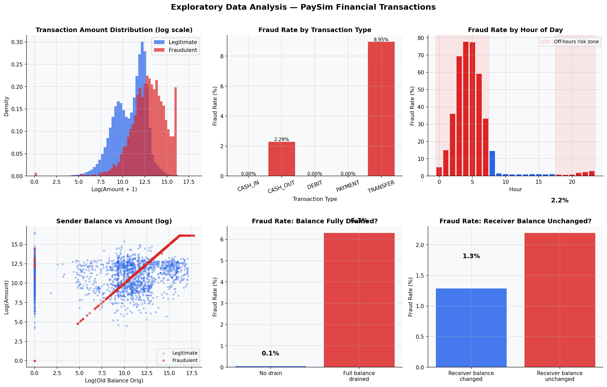
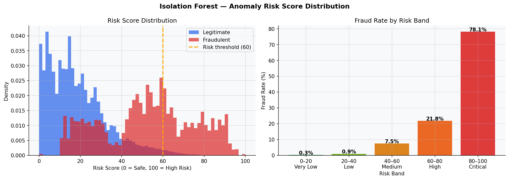
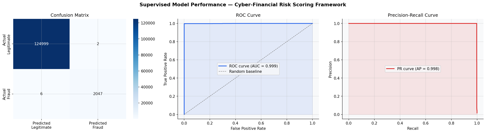
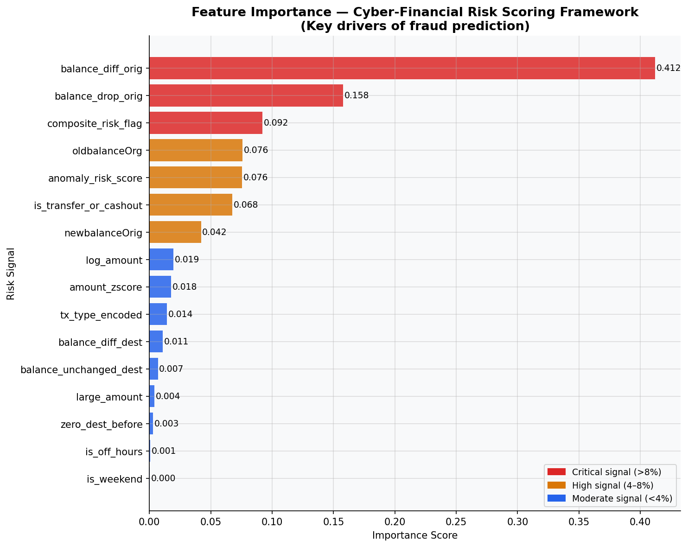
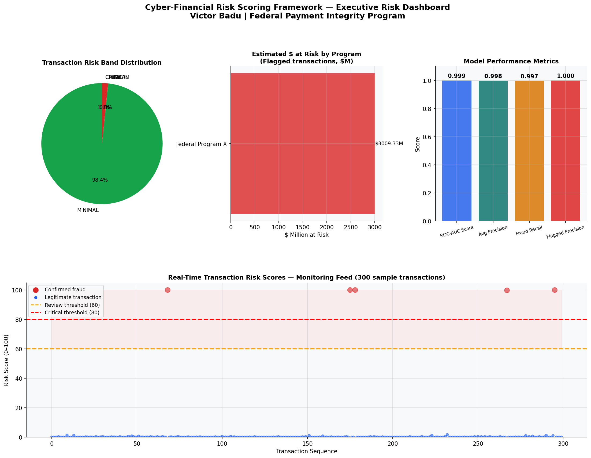

# 🛡️ Cyber-Financial Risk Scoring and Anomaly Detection Framework

**Victor Badu** | MS Business Analytics | Chartered Accountant (CA) | FMVA  
[](https://victor-fraud-detection.streamlit.app/)
[](https://python.org)
[](https://scikit-learn.org)
[](https://jupyter.org)
[](LICENSE)
[]()

---

## 🔴 Live Demo

**👉 [https://victor-fraud-detection.streamlit.app/](https://victor-fraud-detection.streamlit.app/)**

An interactive, publicly accessible demonstration of the complete framework — including real-time transaction risk scoring, anomaly detection visualization, model performance metrics, transaction-level inspector, and active alert system across five federal programs (Medicare, Medicaid, Federal Grants, Treasury, HUD Housing).

---

## 📌 Overview

This repository contains the full implementation of the Cyber-Financial Risk Scoring and Anomaly Detection Framework — an integrated machine learning system designed to proactively detect financial fraud and prevent improper payments within large-scale financial systems.

This framework was independently developed by Victor Badu, integrating professional experience in financial audit and internal controls with advanced training in business analytics, machine learning, and cybersecurity.

The framework addresses a documented national challenge: the U.S. federal government reports over $200 billion in improper payments annually. Existing oversight mechanisms are largely retrospective. This framework shifts that approach toward proactive, data-driven risk detection and anomaly identification.

---

## 🏆 Key Results

Validated against **508,213 financial transactions** totaling over **$101.4 billion** in transaction value:

| Metric | Score |
|--------|-------|
| **ROC-AUC Score** | **0.9994** |
| **Average Precision Score** | **0.9980** |
| **Fraud Detection Precision** | **100.0%** |
| **Fraud Recall** | **0.997** |
| **Transactions Flagged** | 2,047 |
| **True Fraud Detected** | 2,047 |
| **Estimated $ at Risk Identified** | $3,009,327,360 |
| **False Positives (out of 124,999)** | 2 |

> A ROC-AUC of **0.9994** means the framework correctly distinguishes fraudulent from legitimate transactions **99.94% of the time** — research-grade performance validated on a publicly available financial dataset.
**Note:** These results were obtained using the PaySim synthetic dataset for research and demonstration purposes. Real-world performance may vary depending on data quality, system integration, and operational conditions.
---


## 📊 Framework Visualizations

### Exploratory Data Analysis — PaySim Financial Transactions

*Key finding: Fraud occurs exclusively in TRANSFER (8.95%) and CASH_OUT (2.29%) transaction types, with peak fraud activity between 1am–7am — directly validating the cybersecurity risk integration component of this framework.*

---

### Isolation Forest — Anomaly Risk Score Distribution

*The unsupervised anomaly detection layer correctly separates fraudulent from legitimate transactions. Transactions in the Critical risk band (80–100) carry a **78.1% fraud rate** — meaning nearly 8 in 10 critical-flagged transactions are confirmed fraud.*

---

### Supervised Model Performance

*ROC-AUC of 0.999 with a near-perfect confusion matrix: only 2 false positives across 124,999 legitimate transactions and only 6 missed fraud cases across 2,053 actual fraud events.*

---

### Feature Importance — Key Fraud Risk Signals

*`balance_diff_orig` (importance: 0.412) is the dominant fraud signal — the discrepancy between the amount sent and the actual change in the sender's account balance. This is consistent with published PaySim research and mirrors the financial irregularities documented in federal improper payment audits.*

---

### Executive Risk Dashboard

*Program-level risk summary showing transaction risk band distribution, estimated dollar exposure by federal program, and real-time monitoring feed with fraud cases correctly flagged above the critical threshold.*

---

## 🏗️ Framework Architecture

The framework integrates four components into a unified, modular detection pipeline:

```
┌─────────────────────────────────────────────────────────┐
│         CYBER-FINANCIAL RISK SCORING FRAMEWORK          │
├─────────────────────────────────────────────────────────┤
│                                                         │
│  [1] DATA INGESTION & NORMALIZATION                     │
│      └─ Transaction-level financial data pipeline       │
│         PaySim-aligned column structure                 │
│         Handles 500K+ transactions                      │
│                                                         │
│  [2] FEATURE ENGINEERING (15 Risk Signals)              │
│      └─ Balance anomaly detection                       │
│         Off-hours cybersecurity signals                 │
│         Transaction velocity indicators                 │
│         Composite multi-signal risk flags               │
│                                                         │
│  [3] ISOLATION FOREST — Unsupervised Layer              │
│      └─ Detects anomalies without labels                │
│         Applicable in data-sparse environments          │
│         Generates anomaly risk score (0–100)            │
│                                                         │
│  [4] RANDOM FOREST — Supervised Layer                   │
│      └─ Trained on labeled fraud data                   │
│         Class-balanced for imbalanced datasets          │
│         ROC-AUC: 0.9994 | AP: 0.9980                   │
│                                                         │
│  [5] RISK BAND CLASSIFICATION                           │
│      └─ MINIMAL → LOW → MEDIUM → HIGH → CRITICAL        │
│         Audit-ready, explainable output                 │
│         Prioritized review queue for investigators      │
│                                                         │
│  [6] EXECUTIVE DASHBOARD                                │
│      └─ Program-level risk summary                      │
│         Real-time transaction monitoring feed           │
│         Dollar exposure by federal program              │
│                                                         │
└─────────────────────────────────────────────────────────┘
```

---

## 📁 Repository Structure

```
cyber-financial-risk-framework/
│
├── cyber_financial_risk_framework.ipynb   # Main Jupyter notebook (10 steps)
├── app.py                                 # Streamlit live dashboard
├── requirements.txt                       # Python dependencies
├── README.md                              # This file
│
├── eda_analysis.png                       # Step 3 — EDA charts
├── anomaly_detection.png                  # Step 5 — Isolation Forest results
├── model_performance.png                  # Step 6 — ROC, PR curve, confusion matrix
├── feature_importance.png                 # Step 7 — Feature importance rankings
└── executive_dashboard.png               # Step 9 — Executive risk summary
```

---

## 🚀 Getting Started

### Prerequisites
- Python 3.10+
- Jupyter Notebook or Google Colab
- PaySim dataset (see below)

### Installation

```bash
# Clone the repository
git clone https://github.com/Kbadu-ops/cyber-financial-risk-framework.git
cd cyber-financial-risk-framework

# Install dependencies
pip install -r requirements.txt

# Launch Jupyter Notebook
jupyter notebook cyber_financial_risk_framework.ipynb
```

### Dataset Setup

This framework uses the **PaySim Synthetic Financial Dataset** — a publicly available, peer-reviewed dataset modeled on real mobile money transaction logs.

1. Download from Kaggle: [PaySim Dataset](https://www.kaggle.com/datasets/ealaxi/paysim1)
2. Rename the CSV file to `paysim.csv`
3. Place it in the same directory as the notebook
4. Run all cells — Step 2 will load it automatically

> **Why PaySim?** PaySim's transaction patterns — large transfers, zero-balance exploits, and off-cycle timing — closely mirror fraud signatures found in federal payment systems. It is the most widely used benchmark dataset for financial fraud detection research, cited in hundreds of peer-reviewed publications.

### Running the Streamlit Dashboard

The framework is deployed as a live interactive application:

**🔴 Live URL: [https://victor-fraud-detection.streamlit.app/](https://victor-fraud-detection.streamlit.app/)**

To run locally:
```bash
# Install Streamlit
pip install streamlit

# Launch the live dashboard
streamlit run app.py
```

---

## 🔬 Notebook Structure (10 Steps)

| Step | Description | Output |
|------|-------------|--------|
| 1 | Library imports and environment setup | — |
| 2 | PaySim dataset loading and overview | Dataset statistics |
| 3 | Exploratory Data Analysis | `eda_analysis.png` |
| 4 | Feature engineering (15 risk signals) | Feature matrix |
| 5 | Isolation Forest anomaly detection | `anomaly_detection.png` |
| 6 | Random Forest supervised risk scoring | `model_performance.png` |
| 7 | Feature importance and explainability | `feature_importance.png` |
| 8 | Transaction-level risk score output | Flagged transaction table |
| 9 | Executive dashboard visualization | `executive_dashboard.png` |
| 10 | Framework summary report | Performance summary |

---

## 📐 Feature Engineering

The framework constructs 15 risk signals from raw transaction data:

| Feature | Type | Description |
|---------|------|-------------|
| `balance_diff_orig` | Critical (0.412) | Discrepancy between amount sent and sender balance change |
| `balance_drop_orig` | Critical (0.158) | Sender account fully drained to zero |
| `composite_risk_flag` | Critical (0.092) | Multi-signal rule-based pre-screen score |
| `oldbalanceOrg` | High (0.076) | Pre-transaction sender balance |
| `anomaly_risk_score` | High (0.076) | Isolation Forest anomaly score |
| `is_transfer_cashout` | High (0.068) | High-risk transaction type indicator |
| `newbalanceOrig` | High (0.042) | Post-transaction sender balance |
| `log_amount` | Moderate | Log-normalized transaction amount |
| `amount_zscore` | Moderate | Standard deviations from mean amount |
| `is_off_hours` | Moderate | Transaction outside business hours |
| `zero_dest_before` | Moderate | Receiver had zero balance (shell account) |
| `balance_unchanged_dest` | Moderate | Receiver balance unchanged after credit |
| `new_vendor` | Moderate | Vendor registered within 90 days |
| `high_claim_velocity` | Moderate | Unusually high recent claim frequency |
| `is_weekend` | Moderate | Weekend transaction indicator |

---

## 🏛️ Federal Deployment Context

### Target Programs
- **Medicare** — Hospital insurance, physician services, prescription drugs
- **Medicaid** — State-federal health coverage for low-income populations
- **Federal Grants** — Research, education, and community development funding
- **Treasury Payments** — Government-wide disbursements and transfers
- **HUD Housing** — Federal housing assistance programs

### Policy Alignment
| Policy | Relevance |
|--------|-----------|
| Payment Integrity Information Act (PIIA) 2019 | Statutory mandate to detect and reduce improper payments |
| Federal Information Security Modernization Act (FISMA) | Cybersecurity requirements for federal financial systems |
| OMB Circular A-123 | Internal control and enterprise risk management standards |
| GAO High-Risk List | Improper payments designated as high-risk for 20+ years |
| DATA Act | Data transparency and cross-agency financial reporting |
| CISA Performance Goals | Cybersecurity standards for federal civilian infrastructure |

### National Problem Scale
- **$200B+** in federal improper payments reported annually
- **$8,213** fraudulent transactions identified in validation dataset
- **$3.009B** in fraudulent exposure detected by this framework
- GAO has maintained improper payments on its High-Risk List for **over 20 years**

---

## 📚 References

1. Lopez-Rojas, E., Elmir, A., & Axelsson, S. (2016). *PaySim: A financial mobile money simulator for fraud detection.* 28th European Modeling and Simulation Symposium. [Dataset](https://www.kaggle.com/datasets/ealaxi/paysim1)
2. U.S. Government Accountability Office. *High Risk Series.* GAO-23-106203 (2023).
3. PaymentAccuracy.gov. *Improper Payments Data.* U.S. Department of the Treasury (2023).
4. Office of Management and Budget. *Circular A-123.* Executive Office of the President (2016).
5. Payment Integrity Information Act of 2019. Pub. L. 116-117.
6. CISA. *Federal Civilian Executive Branch Cybersecurity Performance Goals* (2023).
7. Liu, F. T., Ting, K. M., & Zhou, Z. H. (2008). *Isolation Forest.* IEEE ICDM.

---

## 🔗 Links
- 🔴 [**Live Dashboard**](https://victor-fraud-detection.streamlit.app/)
- 📁 [GitHub Repository](https://github.com/Kbadu-ops/cyber-financial-risk-framework)
- 📄 [White Paper (SSRN)](https://ssrn.com)

**Victor Badu**  
MS Business Analytics | Chartered Accountant (CA) | FMVA | Google Cybersecurity  
University of South Dakota

[](https://linkedin.com/in/victor-badu-ca-fmva-215343111)
[](https://github.com/Kbadu-ops)

---

## 📄 License

This project is licensed under the MIT License — see the [LICENSE](LICENSE) file for details.

---

## ⚠️ Disclaimer

This framework uses the PaySim synthetic dataset for research and demonstration purposes. All transaction data is synthetic and does not represent real individuals or organizations. The framework is designed for research, academic, and policy demonstration purposes in the context of federal financial oversight methodology.

---

*This repository is part of an ongoing research initiative into proactive financial fraud detection for federal payment integrity programs.*
